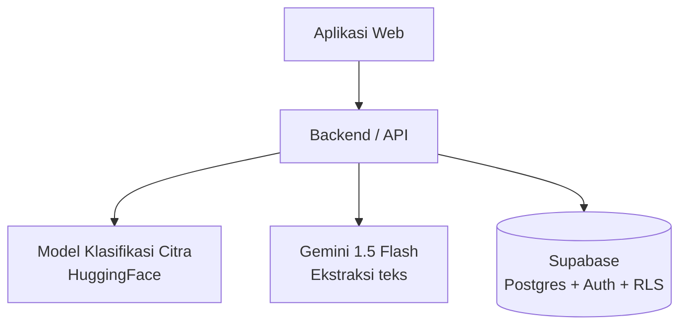
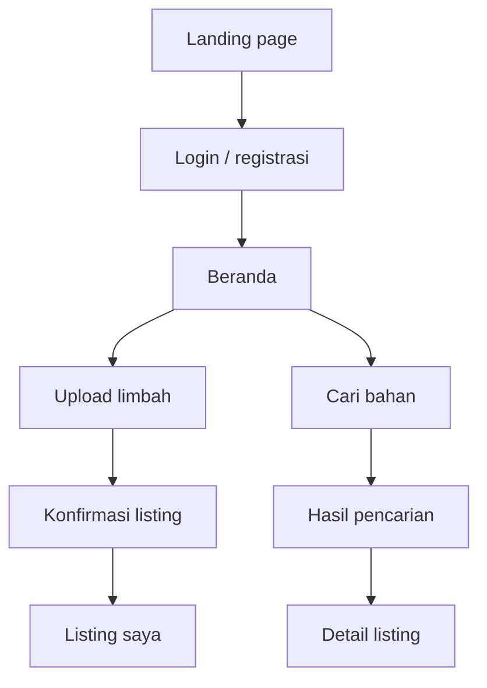
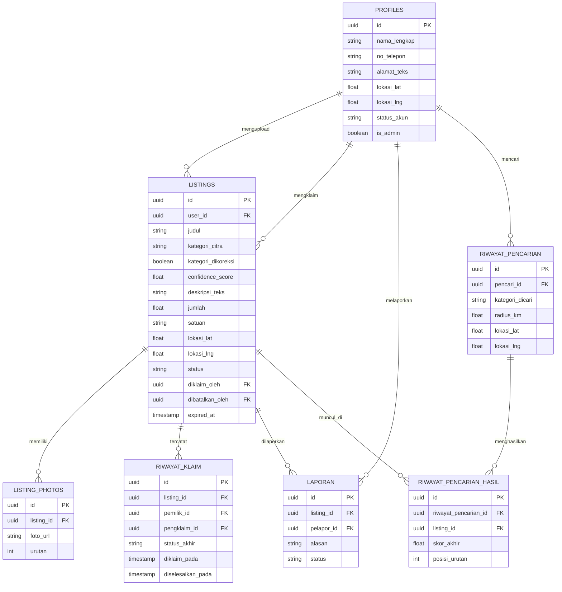

# LoopLink — Tahap 3: Design / Arsitektur

**Kompetisi:** Trunodjoyo Creative Competition 2026 — Cabang Vibe Code

> Catatan: Tahap ini masih dalam diskusi aktif dan dapat berubah. Dokumen ini disusun dengan standar go-to-market (GTM), bukan hanya demo sekali pakai. Database menggunakan **Supabase** (PostgreSQL + Auth + RLS).

---

## A. Arsitektur Sistem

Aplikasi web menjadi satu-satunya titik masuk pengguna. Backend menangani seluruh logika bisnis (termasuk keputusan matching), dan dua layanan AI dipanggil secara terpisah sesuai tugasnya: model klasifikasi citra untuk mengenali jenis limbah dari foto, dan Gemini untuk mengekstrak detail tambahan dari teks. Database menyimpan data pengguna dan listing.



### Model Klasifikasi Citra — Keputusan & Batasan yang Diketahui

Klasifikasi citra memakai model **`google/vit-base-patch16-224`** (ImageNet-1k), bukan model limbah khusus. Label ImageNet-1k dipetakan ke 12 kategori LoopLink (`KELAS_MODEL`) lewat `PEMETAAN_LABEL_IMAGENET` di `lib/ai/klasifikasi.js`. Dua konsekuensi berikut merupakan **keputusan sadar**, bukan bug:

- ImageNet-1k **tidak memiliki kelas "battery"**, dan tidak ada label ImageNet-1k yang dipetakan ke `Trash`.
- Akibatnya `Battery` dan `Trash` **tidak akan pernah muncul sebagai hasil klasifikasi otomatis** AI. Keduanya tetap tersedia sebagai pilihan manual saat user mengoreksi hasil (`perlu_koreksi_manual`), sehingga listing kedua kategori tersebut tetap bisa dibuat.

---

## B. Mekanisme Matching Tanpa Embedding

Awalnya direncanakan pakai sentence embedding untuk mengukur kemiripan semantik antara deskripsi listing dan kebutuhan pencari. Ini **dihapus** dan digantikan pendekatan rule-based murni, dengan alasan:

- Kategori limbah sudah berasal dari daftar tetap (12 kelas hasil model klasifikasi citra) — bukan teks bebas
- Kategori kebutuhan pencari juga dipilih dari dropdown, bukan kolom teks bebas
- Karena keduanya berasal dari himpunan tetap, kecocokan bisa didefinisikan eksplisit lewat tabel aturan, tanpa perlu model tambahan untuk "menerka" makna teks
- Ini lebih mudah dipertanggungjawabkan ke juri — setiap skor bisa ditelusuri asal-usulnya, berbeda dengan embedding yang cenderung jadi kotak hitam

### Tabel `kategori_kecocokan`

Mendefinisikan kategori limbah apa cocok untuk kebutuhan apa, diisi manual berdasarkan riset pemanfaatan limbah:

| kategori_limbah | kategori_kebutuhan | skor_dasar |
|---|---|---|
| Cardboard | Bahan bakar biomassa | 0.9 |
| Cardboard | Bahan baku daur ulang kertas | 1.0 |
| Biological | Bahan bakar biomassa | 1.0 |
| Biological | Kompos | 1.0 |
| Clothes | Bahan baku tekstil daur ulang | 1.0 |
| Metal | Bahan baku pengecoran | 1.0 |
| Plastic | Bahan bakar RDF (Refuse-Derived Fuel) | 0.7 |

### Batasan Tabel `kategori_kecocokan` (Status Saat Ini)

- **`Shoes` sengaja tidak memiliki baris aturan** — keputusan sadar (ditunda), bukan kelupaan. Konsekuensinya skor matching `Shoes` terhadap semua kebutuhan = 0, sehingga listing sepatu tidak akan pernah muncul di hasil pencarian. Penundaan ini terkait prioritas skenario juri/demo yang berfokus pada kertas, kaca, organik, logam, dan plastik.
- Kategori kebutuhan **`Bahan baku daur ulang kaca`** akan diperkenalkan untuk tiga varian kaca (Brown / Green / White-glass) sebagai tujuan reuse cullet. Kaca sengaja dipertahankan sebagai tiga kategori terpisah demi presisi pemilahan warna.

### Formula Skor Akhir

```
skor_akhir = (skor_kecocokan_kategori × 0.5) + (skor_jarak × 0.3) + (skor_volume × 0.2)
```

- `skor_kecocokan_kategori` — diambil langsung dari tabel `kategori_kecocokan`
- `skor_jarak` — normalisasi terbalik dari jarak (makin dekat, makin tinggi)
- `skor_volume` — rasio jumlah tersedia vs jumlah dibutuhkan pencari

### Dampak ke Peta AI/ML (Tahap 1)

Komponen "Sentence embedding (opsional)" dihapus dari peta AI/ML. Sistem jadi lebih sederhana (tidak perlu panggil API tambahan untuk embedding) dan lebih mudah dijelaskan ke juri karena murni logika eksplisit.

---

## C. Menyimpan Hasil Matching sebagai Riwayat

**`riwayat_pencarian`** — mencatat setiap kali pencari melakukan pencarian

| Kolom | Tipe |
|---|---|
| id | uuid (PK) |
| pencari_id | uuid (FK → profiles) |
| kategori_dicari | enum |
| radius_km | float |
| lokasi_lat / lokasi_lng | float (lokasi pencari saat itu) |
| dibuat_pada | timestamp |

**`riwayat_pencarian_hasil`** — mencatat listing apa saja yang muncul di setiap pencarian, beserta skornya

| Kolom | Tipe |
|---|---|
| id | uuid (PK) |
| riwayat_pencarian_id | uuid (FK) |
| listing_id | uuid (FK → listings) |
| skor_akhir | float |
| posisi_urutan | integer |

Kegunaan untuk GTM: analisis kategori yang sering dicari tapi jarang match, listing yang sering muncul tapi tidak pernah diklaim — data untuk perbaikan produk pasca-lomba.

---

## D. Struktur Database (Lengkap, Sudah Dikritisi untuk Supabase)

### Koreksi Penting Sebelum Skema

1. **Tabel `users` diganti jadi `profiles`.** Supabase Auth sudah punya `auth.users` bawaan yang menangani autentikasi (termasuk password) secara aman. Tabel custom tidak perlu kolom `password_hash` — `id` di `profiles` mereferensikan `auth.users(id)` langsung (pola standar Supabase).
2. **Aksi klaim tidak bisa mengandalkan RLS UPDATE biasa.** Kalau RLS `listings` dibuat "hanya pemilik boleh UPDATE", pengklaim tidak akan bisa mengubah status jadi "dipesan" karena bukan pemilik listing. Solusinya: aksi klaim/selesai/batal dijalankan lewat **Postgres Function (RPC) dengan `SECURITY DEFINER`** yang memvalidasi kondisi (status masih tersedia, bukan listing sendiri, dst) sebelum mengubah data — bukan lewat UPDATE langsung dari client.
3. **Butuh pembeda admin/moderator.** Ini beda konteks dari "tidak ada role" di marketplace (yang berlaku untuk penjual/pembeli), karena meninjau `laporan` butuh akses berbeda dari user biasa. Ditambahkan kolom `is_admin` di `profiles`.
4. **Soft delete, bukan hard delete.** Kalau user hapus akun saat listing-nya sedang berstatus "dipesan", hard delete akan merusak data pihak yang sudah klaim. Penghapusan akun diwakili `status_akun = nonaktif`, bukan `DELETE` baris.
5. **Pencarian berbasis lokasi butuh strategi index.** Query "cari listing dalam radius X km" dengan `lat`/`lng` biasa akan melambat seiring data bertambah. Untuk prototype, hitung jarak manual (formula Haversine) masih memadai; PostGIS dicatat sebagai peningkatan skalabilitas di roadmap.

### Tabel Inti

**`profiles`**

| Kolom | Tipe | Keterangan |
|---|---|---|
| id | uuid (PK, FK → auth.users) | Bukan tabel auth sendiri — mengikuti Supabase Auth |
| nama_lengkap | string | |
| no_telepon | string | Untuk kontak antar user |
| alamat_teks | string | Alamat singkat, ditampilkan ke user lain |
| lokasi_lat / lokasi_lng | float | Untuk hitung jarak & radius pencarian |
| status_akun | enum(`aktif`, `nonaktif`, `diblokir`) | Soft delete lewat kolom ini |
| is_admin | boolean (default false) | Pembeda akses moderasi, bukan role marketplace |
| created_at / updated_at | timestamp | |

**`listings`**

| Kolom | Tipe | Keterangan |
|---|---|---|
| id | uuid (PK) | |
| user_id | uuid (FK → profiles) | Pemilik listing |
| judul | string | |
| kategori_citra | enum (12 kategori sesuai model) | Hasil klasifikasi AI |
| kategori_dikoreksi | boolean | Apakah user mengoreksi hasil AI |
| confidence_score | float | Tingkat keyakinan model |
| deskripsi_teks | string (nullable) | Hasil ekstraksi Gemini |
| jumlah | float | |
| satuan | enum(`kg`, `karung`, `ton`, `unit`) | |
| lokasi_lat / lokasi_lng | float | Lokasi pickup |
| status | enum(`tersedia`, `dipesan`, `selesai`, `dibatalkan`) | Diubah hanya lewat RPC untuk perubahan status |
| diklaim_oleh | uuid (FK → profiles, nullable) | |
| dibatalkan_oleh | uuid (FK → profiles, nullable) | Mencatat siapa membatalkan, untuk trust score masa depan |
| expired_at | timestamp | Listing otomatis nonaktif setelah periode tertentu |
| created_at / updated_at | timestamp | |

### Tabel Pendukung

**`listing_photos`**

| Kolom | Tipe |
|---|---|
| id | uuid (PK) |
| listing_id | uuid (FK) |
| foto_url | string |
| urutan | integer |

**`riwayat_klaim`** — log transaksi, terpisah dari `listings` supaya histori tetap ada meski listing dihapus

| Kolom | Tipe |
|---|---|
| id | uuid (PK) |
| listing_id | uuid (FK) |
| pemilik_id | uuid (FK → profiles) |
| pengklaim_id | uuid (FK → profiles) |
| status_akhir | enum(`selesai`, `dibatalkan`) |
| diklaim_pada / diselesaikan_pada | timestamp |

**`laporan`**

| Kolom | Tipe |
|---|---|
| id | uuid (PK) |
| listing_id | uuid (FK) |
| pelapor_id | uuid (FK → profiles) |
| alasan | string |
| status | enum(`menunggu`, `ditinjau`, `selesai`) |
| created_at | timestamp |

**`kategori_kecocokan`**

| Kolom | Tipe |
|---|---|
| id | uuid (PK) |
| kategori_limbah | enum |
| kategori_kebutuhan | string |
| skor_dasar | float |

**`riwayat_pencarian`** dan **`riwayat_pencarian_hasil`** — lihat bagian C.

### Prioritas Implementasi Database
- **Wajib untuk prototype lomba:** `profiles`, `listings`, `listing_photos`, `kategori_kecocokan`
- **Perlu untuk GTM (dibangun setelah lomba):** `riwayat_klaim`, `laporan`, `riwayat_pencarian`, `riwayat_pencarian_hasil`

---

## E. Kebijakan RLS (Row Level Security) — Supabase

| Tabel | SELECT | INSERT | UPDATE | DELETE |
|---|---|---|---|---|
| `profiles` | Semua authenticated user (untuk lihat kontak) | User buat baris sendiri saat daftar (`auth.uid() = id`) | Hanya diri sendiri | Tidak diizinkan langsung (soft delete via `status_akun`) |
| `listings` | Publik: hanya status `tersedia`. Pemilik: semua miliknya | Authenticated, `user_id = auth.uid()` | Hanya pemilik untuk field non-status; perubahan status/klaim **wajib lewat RPC**, bukan UPDATE langsung | Hanya pemilik, hanya jika status masih `tersedia` |
| `listing_photos` | Mengikuti visibilitas listing induk | Hanya pemilik listing terkait | Hanya pemilik listing terkait | Hanya pemilik listing terkait |
| `riwayat_klaim` | Hanya pemilik atau pengklaim terkait | Hanya lewat RPC (system-triggered) | Tidak diizinkan (immutable log) | Tidak diizinkan |
| `laporan` | Pelapor sendiri, atau admin (`is_admin = true`) | Authenticated, `pelapor_id = auth.uid()` | Hanya admin (ubah status tinjauan) | Tidak diizinkan |
| `kategori_kecocokan` | Publik (read-only, referensi) | Hanya admin | Hanya admin | Hanya admin |
| `riwayat_pencarian` / `riwayat_pencarian_hasil` | Hanya pencari terkait | System-triggered saat pencarian dijalankan | Tidak diizinkan | Tidak diizinkan |

---

## F. Aturan Bisnis yang Diputuskan

**1. Siapa yang menandai transaksi "Selesai"?**
Pemilik listing (bukan konfirmasi dua arah) — lebih sederhana untuk didemokan, mengurangi risiko transaksi menggantung. Konfirmasi dua arah dicatat sebagai peningkatan roadmap GTM.

**2. Siapa yang bisa membatalkan klaim?**
Kedua pihak bisa, dan sistem mencatat siapa yang membatalkan (`dibatalkan_oleh`) — fondasi data trust score di masa depan.

**3. Bagaimana kalau user menolak izin akses lokasi saat onboarding?**
Wajib ada jalur alternatif input alamat manual — bukan edge case kecil karena sistem berbasis hiper-lokal.

**4. Bagaimana kalau confidence score AI rendah?**
Dibedakan dari kegagalan total. Di bawah ambang tertentu (misal 60%), sistem mendorong user memilih kategori manual, bukan otomatis meloloskan kategori yang kemungkinan salah.

---

## G. Daftar Interface (Halaman) — Prioritas Build

### Tingkat 1 — Wajib untuk Demo Prototype

**Publik (belum login)**
1. Landing Page
2. Login
3. Register
4. Lupa Password
5. Reset Password (via link email)

**Onboarding**
6. Setup Lokasi Awal (izin akses lokasi / input manual alamat sebagai fallback wajib)

**Navigasi Utama**
7. Home / Dashboard

**Flow Upload Limbah**
8. Upload Foto (capture/pilih gambar)
9. Memproses AI (loading gabungan — klasifikasi citra + ekstraksi teks dalam satu indikator progres)
10. Review & Koreksi Kategori + Form Detail Listing (dengan live preview di form yang sama)
11. Konfirmasi Sukses Upload
12. Edit Listing (untuk status Tersedia)
13. Konfirmasi Hapus/Batalkan Listing

**Flow Cari Bahan**
14. Form Pencarian (kebutuhan + radius slider + filter kategori)
15. Hasil Pencarian (skeleton loading di halaman yang sama, sort/filter sebagai drawer/modal)
16. Empty State — hasil kosong (saran: perluas radius, ubah kata kunci)

**Detail Listing & Klaim**
17. Detail Listing (termasuk tombol Laporkan)
18. Modal Konfirmasi Klaim → langsung tampilkan info kontak
19. Konfirmasi Selesaikan Transaksi (dipicu pemilik listing)
20. Modal Batalkan Klaim (dipicu pemilik atau pengklaim)

**Manajemen Pribadi**
21. Listing Saya (tab/filter status: Semua, Tersedia, Dipesan, Selesai)
22. Klaim Saya (listing yang diklaim, dengan status tracking)
23. Profil Saya (lihat + mode edit dalam satu halaman)
24. Pengaturan Akun (ubah password, ubah lokasi default)

**Error & Edge Case Penting**
25. 404 Not Found
26. Error koneksi/server
27. AI classification gagal (fallback: input kategori manual)
28. Confidence rendah (dorong koreksi manual)
29. Unauthorized access (misal buka listing yang sudah dihapus)

### Tingkat 2 — Perlu untuk GTM (Setelah Lomba)
30. Halaman Verifikasi Email
31. Notifikasi (list)
32. Riwayat Transaksi Gabungan (sebagai pengupload maupun pengklaim)
33. Modal/Form Laporkan Listing
34. Tutorial singkat / walkthrough

### Tingkat 3 — Roadmap Jangka Panjang
35. Dashboard Admin/Moderator (meninjau laporan, menonaktifkan akun bermasalah)
36. Rating/ulasan setelah transaksi selesai (fondasi trust score)

### Supporting / Legal
37. Tentang LoopLink
38. FAQ / Bantuan
39. Syarat & Ketentuan
40. Kebijakan Privasi
41. Kontak/Support

---

## H. Peta Navigasi (Sitemap)



---

## I. ERD (Struktur Database)



---

## J. Ringkasan Keputusan Arsitektur

| Aspek | Keputusan | Alasan |
|---|---|---|
| Jumlah tabel inti | 2 (`profiles`, `listings`) + tabel pendukung | Inti tetap sederhana, tabel pendukung menambah kesiapan GTM |
| Sistem peran akun marketplace | Tidak ada — satu jenis akun untuk semua | Semua user bisa upload & cari bahan tanpa batasan |
| Pembeda admin | Kolom `is_admin` di `profiles` | Beda konteks dari role marketplace — kebutuhan operasional platform |
| Mekanisme matching | Rule-based via tabel `kategori_kecocokan`, tanpa embedding | Kategori berasal dari himpunan tetap, hasil skor bisa ditelusuri eksplisit |
| Penyimpanan hasil matching | Disimpan sebagai riwayat (`riwayat_pencarian`, `riwayat_pencarian_hasil`) | Data untuk analisis produk pasca-lomba |
| Perubahan status listing | Lewat RPC (`SECURITY DEFINER`), bukan RLS UPDATE langsung | RLS owner-only tidak cukup karena pengklaim bukan pemilik listing |
| Penghapusan akun/listing | Soft delete | Mencegah kerusakan data transaksi yang sedang berjalan |
| Penyelesaian transaksi | Dipicu oleh pemilik listing | Sederhana untuk didemokan, mengurangi risiko transaksi menggantung |
| Pembatalan klaim | Kedua pihak bisa, tercatat siapa yang membatalkan | Fondasi data trust score di masa depan |
| Fallback lokasi ditolak | Wajib ada input alamat manual | Sistem berbasis hiper-lokal, bukan edge case kecil |
| Confidence AI rendah | State khusus mendorong koreksi manual | Mencegah kategori salah lolos otomatis |
| Pencarian berbasis lokasi | Haversine manual untuk prototype, PostGIS untuk skalabilitas | Index geospasial penuh belum perlu di tahap prototype |

---

*Bagian dari dokumentasi Spec-Driven Development (SDD) project LoopLink.*
